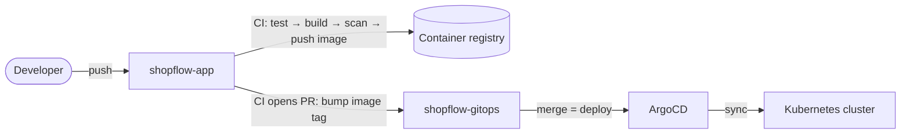

# ShopFlow GitOps

Deployment configuration for **[ShopFlow](https://github.com/chaithanyareddyk3273/shopflow-app)**, a microservices order system on Kubernetes.

This repo is the **single source of truth for what runs in each environment**. In Phase 2, ArgoCD watches it and syncs the cluster to match. CI never runs `kubectl` or `helm` against a cluster. It opens a pull request here that bumps an image tag, and merging that PR *is* the deployment.



## Layout

```
shopflow-gitops/
├── charts/shopflow/          # Helm chart for the whole system
│   ├── values.yaml           # defaults
│   └── templates/
│       ├── services.yaml     # Deployment + Service per microservice (driven by values)
│       ├── postgres.yaml     # StatefulSet, one database per service
│       ├── rabbitmq.yaml     # StatefulSet
│       └── secrets.yaml      # dev-only; replaced by Sealed Secrets in Phase 3
├── environments/
│   └── dev/values.yaml       # local kind cluster overrides
└── kind/kind-config.yaml     # local cluster definition
```

## Chart highlights

- **One template for all microservices.** Adding a service is a values change, not a new template.
- **Credentials injected from a Secret.** Connection strings are assembled with Kubernetes `$(VAR)` expansion, so passwords never appear in rendered config.
- **Startup, liveness and readiness probes.** Slow first starts aren't killed, and pods only get traffic when their dependencies are reachable.
- **Hardened pod security.** `runAsNonRoot`, read-only root filesystem, all capabilities dropped, seccomp `RuntimeDefault`.
- **Automatic rollout on credential change.** A checksum annotation on the Secret triggers it.
- **Prometheus scrape annotations** on every service.

## Validate locally

```bash
helm lint charts/shopflow -f environments/dev/values.yaml
helm template shopflow charts/shopflow -f environments/dev/values.yaml | kubeconform -strict -summary
```

## Deploy to kind

See **[shopflow-app → Run it locally](https://github.com/chaithanyareddyk3273/shopflow-app#-run-it-locally)**. `scripts/kind-up.sh` builds the images and installs this chart.
