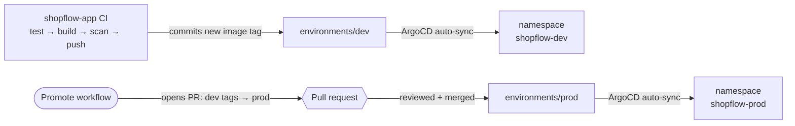

# ShopFlow GitOps

[](https://github.com/chaithanyareddyk3273/shopflow-gitops/actions/workflows/validate.yml)

Deployment configuration for **[ShopFlow](https://github.com/chaithanyareddyk3273/shopflow-app)**, a microservices order system on Kubernetes.

> 📖 **New to Helm, ArgoCD or Kubernetes? Read the [walkthrough](docs/HELM_WALKTHROUGH.md)** first. It explains every file in plain English.

This repo is the **single source of truth for what runs in each environment**. **ArgoCD** runs inside the cluster, watches this repo, and keeps each environment identical to what's on `main`. CI never runs `kubectl` or `helm` against a cluster and holds no cluster credentials. It only commits here, and **a commit is a deployment**.



## Environments

| Environment | Namespace | Deployed by | Images | Changes when |
|---|---|---|---|---|
| **local** | `shopflow` | `kind-up.sh` (Helm) | built on your laptop | you run the script |
| **dev** | `shopflow-dev` | **ArgoCD** | `ghcr.io/…:sha-<commit>` | **automatically**, after every green build on shopflow-app `main` |
| **prod** | `shopflow-prod` | **ArgoCD** | `ghcr.io/…:sha-<commit>` | only when a **promotion PR** is merged |

**Promote dev → prod:** Actions tab → **"Promote dev → prod"** → *Run workflow*. It opens a PR showing exactly which versions change. Merge it to deploy; **revert it to roll back**.

## Layout

```
shopflow-gitops/
├── charts/shopflow/              # Helm chart for the whole system
│   ├── values.yaml               # defaults
│   └── templates/
│       ├── services.yaml         # Deployment + Service per microservice (driven by values)
│       ├── postgres.yaml         # StatefulSet, one database per service
│       ├── rabbitmq.yaml         # StatefulSet
│       └── secrets.yaml          # dev-only; replaced by Sealed Secrets in Phase 3
├── environments/
│   ├── local/values.yaml         # laptop: locally built images
│   ├── dev/values.yaml           # image tags written by CI
│   └── prod/values.yaml          # image tags changed only by promotion PRs
├── argocd/
│   ├── root.yaml                 # app-of-apps: the one Application applied by hand
│   └── apps/                     # one ArgoCD Application per environment
├── .github/workflows/
│   ├── validate.yml              # helm lint + kubeconform for every environment, on every PR
│   └── promote.yml               # opens the dev → prod promotion PR
├── scripts/argocd-up.sh          # installs ArgoCD in kind and applies root.yaml
├── docs/HELM_WALKTHROUGH.md      # plain-English guide to every file
└── kind/kind-config.yaml         # local cluster definition
```

## Chart highlights

- **One template for all microservices.** Adding a service is a values change, not a new template.
- **One chart, three environments.** Environments differ only in a small values file (replicas, image source and tags).
- **Credentials injected from a Secret.** Connection strings are assembled with Kubernetes `$(VAR)` expansion, so passwords never appear in rendered config.
- **Startup, liveness and readiness probes.** Slow first starts aren't killed, and pods only get traffic when their dependencies are reachable.
- **Hardened pod security.** `runAsNonRoot`, read-only root filesystem, all capabilities dropped, seccomp `RuntimeDefault`.
- **Automatic rollout on credential change.** A checksum annotation on the Secret triggers it.
- **ArgoCD self-heal and prune.** Manual `kubectl` edits are reverted, and resources removed from Git are removed from the cluster.

## Run it

```bash
./scripts/argocd-up.sh                     # installs ArgoCD in kind; it then deploys dev and prod by itself
kubectl get applications -n argocd         # shopflow-dev / shopflow-prod: Synced + Healthy
```

ArgoCD UI: `kubectl port-forward -n argocd svc/argocd-server 8443:443` → https://localhost:8443 (user `admin`; the script prints how to get the password).

## Validate locally

```bash
for env in local dev prod; do
  helm lint charts/shopflow -f environments/$env/values.yaml
  helm template shopflow charts/shopflow -f environments/$env/values.yaml | kubeconform -strict -summary -
done
```
