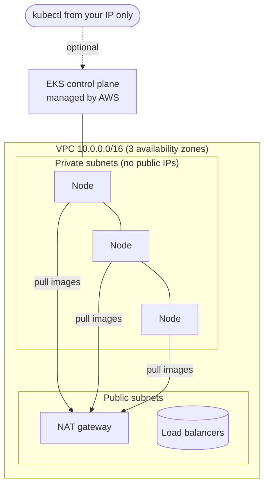

# ☁️ ShopFlow on AWS: Terraform for EKS

This creates the AWS infrastructure for running ShopFlow on **Amazon EKS** (managed Kubernetes). Once the cluster exists, **ArgoCD deploys everything else from this repo**, exactly as it does on the local kind cluster.

> **Status:** written and checked by CI on every pull request (`terraform fmt`, `terraform validate` against the real AWS provider and modules, and a **Trivy** security scan), but **never applied**: no AWS account was used, so it has cost $0. The steps below are what applying it would take.

## What it creates



| File | What it defines |
|---|---|
| `versions.tf` | Terraform and provider versions, default tags, and the (commented) S3 remote state with native locking |
| `variables.tf` | Every setting, with safe defaults |
| `main.tf` | **VPC** (official module): private subnets for nodes, public for load balancers, one NAT gateway. **EKS** (official module v21): managed node group on Amazon Linux 2023, add-ons (VPC CNI, CoreDNS, kube-proxy, Pod Identity, EBS CSI). An **IAM role for the EBS driver** through EKS Pod Identity (no access keys). An encrypted **gp3 StorageClass** for the Postgres and RabbitMQ volumes. A **budget alert** email. |
| `outputs.tf` | Cluster name, API endpoint, and the `aws eks update-kubeconfig` command |
| `.trivyignore` | Accepted scanner findings, each with a written reason |

## Security choices

| Choice | Why |
|---|---|
| **Kubernetes API private by default** | `api_allowed_cidrs = []` means there's no internet access to the API at all. To use kubectl from a laptop, list **your own IP**. `0.0.0.0/0` is **rejected** by a validation rule. |
| **Nodes in private subnets** | Nothing on the internet can reach a node directly. |
| **Pod Identity instead of access keys** | The EBS driver gets AWS permissions through a role, with no long-lived keys stored anywhere. |
| **Encrypted volumes** | The gp3 StorageClass sets `encrypted: "true"`. |
| **Trivy in CI** | The first scan found the API open to `0.0.0.0/0` (2 CRITICAL). That was fixed by making it private by default. One finding is accepted: nodes need outbound internet to pull images (see `.trivyignore`). |

## Cost (us-east-1, estimated)

| Item | Per hour |
|---|---|
| EKS control plane | $0.10 |
| 3 × t3.medium nodes, on-demand | $0.125 (≈ $0.04 with SPOT) |
| NAT gateway | $0.045 + data |
| EBS volumes (nodes + PVCs) | ≈ $0.01 |
| **Total** | **≈ $0.28/h (≈ $6.70/day); ≈ $0.20/h with SPOT** |

Left running for a whole month that's ≈ $200, so the plan is: **create, demo, `terraform destroy` the same day.** The budget alert emails you if the month's spend is forecast to pass `monthly_budget_usd` (default $20).

## How to run it (with an AWS account)

```bash
# 0. Log in to AWS (SSO recommended). Terraform uses that login: no keys in files.
aws configure sso && aws sso login

# 1. One-time: a bucket for Terraform state, then uncomment the backend block in versions.tf
aws s3api create-bucket --bucket <your-terraform-state-bucket> --region us-east-1
aws s3api put-bucket-versioning --bucket <your-terraform-state-bucket> --versioning-configuration Status=Enabled

# 2. Settings: your IP, SPOT, budget email
cp terraform.tfvars.example terraform.tfvars   # then edit it

# 3. Create everything (~15 minutes)
terraform init
terraform plan -out tfplan      # review what will be created
terraform apply tfplan

# 4. Point kubectl at the new cluster
$(terraform output -raw configure_kubectl)

# 5. Hand it to ArgoCD: same install as on kind, then the app-of-apps
kubectl create namespace argocd
kubectl apply -n argocd --server-side --force-conflicts \
  -f https://raw.githubusercontent.com/argoproj/argo-cd/stable/manifests/install.yaml
kubectl apply -f ../../argocd/root.yaml

# 6. New cluster = new Sealed Secrets key: re-encrypt each environment's passwords
../../scripts/seal-credentials.sh shopflow-dev    # paste into environments/dev/values.yaml, PR, merge

# 7. When finished: delete EVERYTHING so it stops costing money
terraform destroy
```

**Differences from kind to handle when moving to EKS** (the next steps for this project):
- `platform-metrics-server` passes `--kubelet-insecure-tls`, which only kind needs; remove it for EKS.
- Expose orders-api through the **AWS Load Balancer Controller** (an Ingress) instead of `kubectl port-forward`.
- Prefer **Amazon RDS** and **Amazon MQ** over in-cluster Postgres and RabbitMQ for real data (backups, failover, upgrades handled by AWS).
